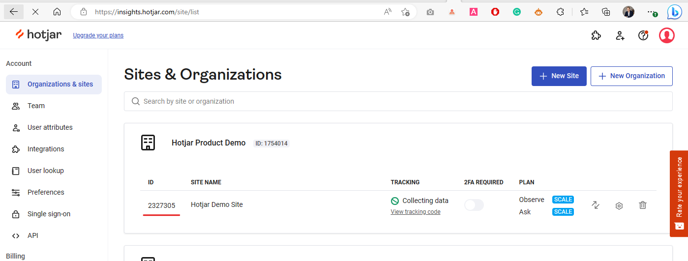

# Overview

Hotjar module allows you to assign Hotjar Site Id for a Store and get insights about the shopping behaviour of your users from Heatmaps, Recordings, Feedback and etc.


## Key Features
1. Store Configuration.
1. Integarted with Vue B2B Theme and Virto Storefront.
1. Ready for integration with other sales channels.
1. Application menu.

## Screenshots


## Setup
First, [Create and сonfigure Hotjar Account](https://www.hotjar.com/)

Save your Site Id.



1. Open Virto Commerce Back Office.
1. Select Store and Open Store Settings.
1. Find Hotjar section.
1. Enable Hotjar and enter your Site Id.


Once you click Save for Store, the Hotjar will be activated.

## Integration with Virto Storefront
Virto Storefront and Vue B2B Theme has native integration with Hotjar module. 

## Application Menu 
The module adds Hotjar link into Application menu. It redirects to Hotjar Dashboard. 


## Integration with Custom Application
You can use either Store settings or Rest API to request Hotjar configuration for store.

## Settings
Hotjar module defines two store settings:

1. Hotjar.EnableTracking
1. Hotjar.SiteId

## Rest API

### Get Hotjar Settings 

Endpoint: `/api/hotjar/{storeId}`

Method: `GET`

Request parameter: Store Id.

Response:

```json
{
  "enableTracking": true,
  "siteId": "2235345",
  "hotjarVersion": 6
}
```

### Update Hotjar Settings
Use Store API to provide management above Hotjar Settings. 

## Hotjar Documentation
You can find more detail abot Hotjar  in [Hotjar Documentation](https://help.hotjar.com/hc/en-us).
